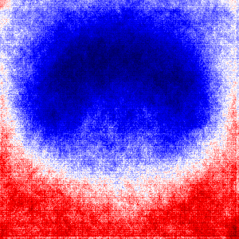

# Q1. Summary
1. Load in .jpg image data and produced a .mat file holding all 5813 images 
2. Produce AUC values for each quadrant when images divided into 3x3 squares
3. Produce a k-fold analysis that uses models below to predict species. 
    Run each of the models below a few times to find optimal settings. 
    - KNN
    - RF
    - SVM
    - CNN
4. Use a pretrained thingy to see if they can correctly guess mushrooms in every image?
5. Image segmentation & Data Augmentation
    - Take a small subsample of the data
    - try and perform segmentation and get them to count np. of mushrooms in each picture
    - Only use 100 images --> perform data augmentation 
 

# Q2. Dataset Description

## Dataset Description
*New Dataset*
Brief description: Images were pulled from Kaggle (https://www.kaggle.com/maysee/mushrooms-classification-common
-genuss-images). Data came in 9 separate folders containing 300-1500 images of Northern European mushrooms. The first
 step of my project was converting these images to fixed 300x300 dimentions. Most images were close to square so
  there wasn't much distortion. 

Total number of samples: 5816
Total number of measurements: 300x300 images --> 9000 pixels
Brief description of the measurements: N/A Image data
Nature of the group of interest and what differentiates it from the other
samples: Multi-class classification problem. Every image should be classified as one of 9 genuses. 
Sample counts for each genus: 

## AUC Values
Instead of dividing up my features into quadrants, I produced an AUC heat map. The image `aucplot.png` in the `project
/figs` directory shows that the majority of pixels that helped identify mushrooms we're in the upper center section
 of the image. Each value is represented as a distance from 0.50. i.e. an AUC value of 0.2 would register as -0.30. 
 
*AUC Heatmap of Shroom Data*

# Q3. Details

## Data pre-processing
Load in .jpg image data and produced a .mat file holding all 5813 images 

`project.src.data_preproc: img_resize()` 
- For this step, I went through each jpg image and resizes the images to (300, 300) images. This was simply to reduce
 the sheer volume of features, and to import uniformity in my dataset for later steps. This presented a more
  challenging dataset (reduced resolution = less precision in features), but significantly sped up my run time for the
   more sophisticated models used in k-fold validation. 

`project.src.data_preproc: img_to_mat()` 
- Classification problem (P3): After data was resized, I converted the 5813 images into a single `.mat` file with every
 image in a (300,300) shape. The `shrooms.mat` is configured very similarly to the mnist dataset, with a dictionary
  containing: `keys = each class` (species), `value = np.array (instances, 300, 300)`. This reduced the
   image storage from 2GB to 500MB on my disk. I chose not to separate the data into training and test sets as I knew
    I would be performing a k-fold validation later. 
- Segmentation problem (P5): This function was adapted to produce `seg_shroom.mat`. This file contained 99 numpy
 arrays in total, 11 instances of each class. The arrays stores in `seg_shroom.mat` are not grayscale, as they'll be
  used for segmentation and coloured images can improve performance. 

`project.src.data_preproc: load_shroom_data()`
- This function pulls out arrays from `shrooms.mat` file and returns data and label arrays in either (instances, 300
, 300) or (instances, 9000) shapes, depending on the being ran. (i.e. CNN requires a 

## Data analysis
Produce AUC heat-map for AUC value at each pixel. 

## K-Fold analysis: MUlti-class Classification
Produce a k-fold analysis that uses models below to predict species. 
    Run each of the models below a few times to find optimal settings. 
    - KNN
    - RF
    - SVM
    - CNN
## Playing around with a pretrained model 
###a) Integrate no-mushroom data
###b) Test
Use a pretrained thingy to see if they can correctly guess mushrooms in every image?
##Counting Shrooms: Image segmentation & Data Augmentation
    - Take a small subsample of the data
    - try and perform segmentation and get them to count np. of mushrooms in each picture
    - Only use 100 images --> perform data augmentation 
 